# ResearchHub

**Simplified Scientific Proposal & Experiment Management**

## Scientific Project & Experiment Platform

<p align="center">
  
  
  
  
  
  
  
  
  
  
</p>

**ResearchHub** is a simplified platform for managing scientific research projects end to end — inspired by synchrotron-style proposal workflows, without cloning a full facility information system.

**client-ui** — researchers can:

- create projects and submit proposals
- go through scientific review
- schedule experiments and link publications
- invite collaborators (email + in-app)

**admin-ui** — platform admins can:

- approve or reject proposals
- manage users, facilities, and catalog data
- oversee projects, publications, and invitations

---

## Demo video

▶ [ResearchHub Demo — Scientific Proposal & Experiment Platform](https://youtu.be/xQ7zukVP5Z8)

Full walkthrough on YouTube: client-ui, admin-ui, and the end-to-end research workflow.

---

## Project article

📝 [ResearchHub — Scientific Proposal & Experiment Platform](https://yaakoub-chaker-bteit.web.app/news/researchhub-scientific-proposal-experiment-platform-5uoQ9RRVBQU42TWy4Hf8)

Full write-up on my portfolio: architecture, stack, and what the platform does.

---

## Product preview

### Desktop — Client UI

<p align="center"><strong>Landing</strong></p>
<p align="center">
  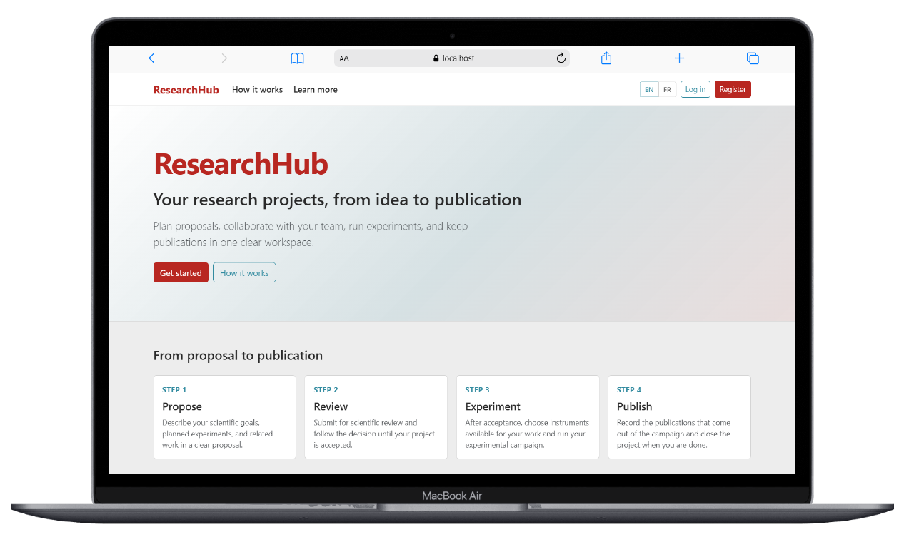
</p>

<br/>

<p align="center"><strong>Projects list</strong></p>
<p align="center">
  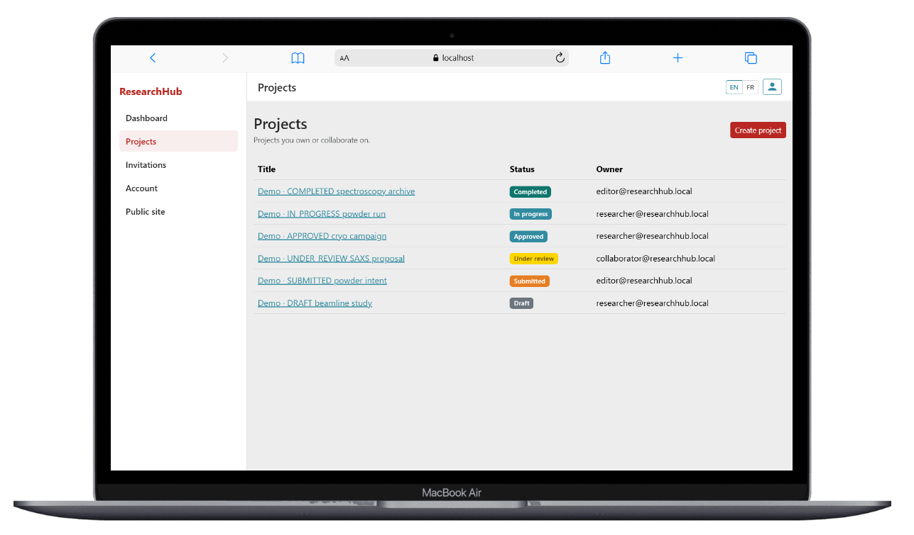
</p>

<br/>

<p align="center"><strong>Project details</strong></p>
<p align="center">
  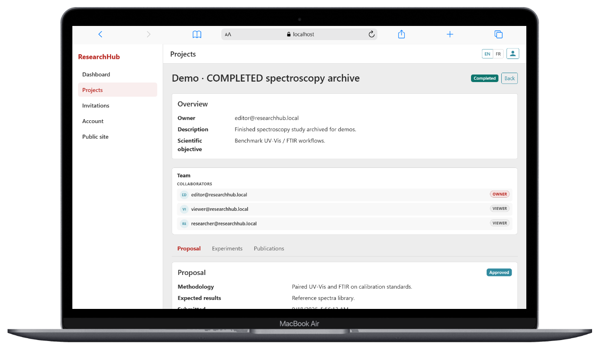
</p>

<br/>

<p align="center"><strong>Add experiment</strong></p>
<p align="center">
  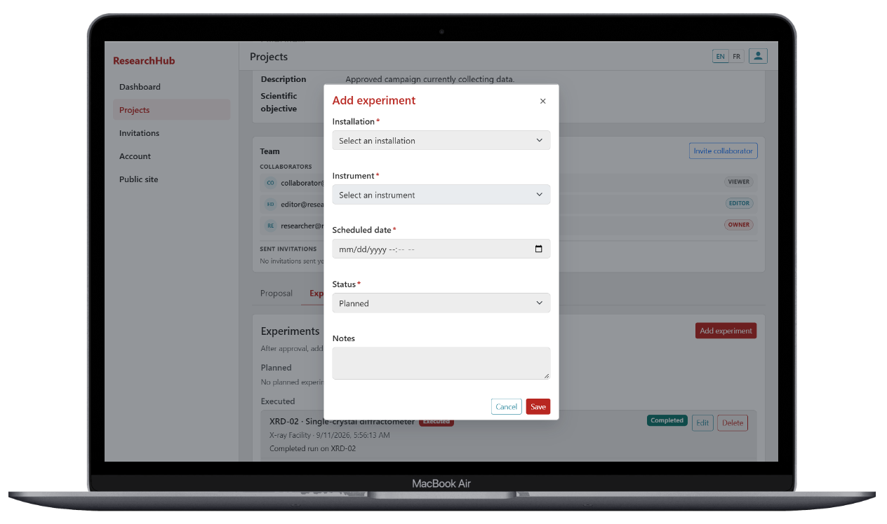
</p>

<br/>

<p align="center"><strong>Form example</strong></p>
<p align="center">
  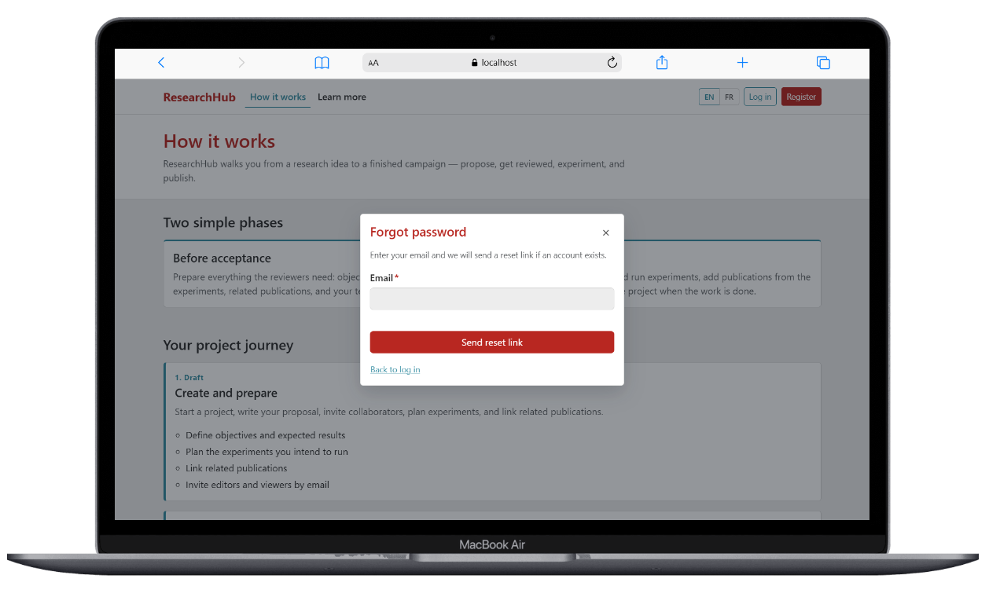
</p>

<br/>

### Desktop — Admin UI

<p align="center"><strong>Dashboard</strong></p>
<p align="center">
  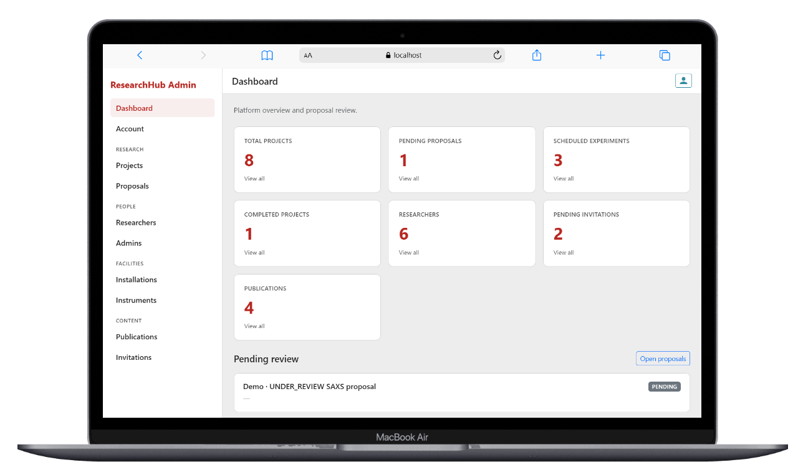
</p>

<br/>

<p align="center"><strong>Proposals review</strong></p>
<p align="center">
  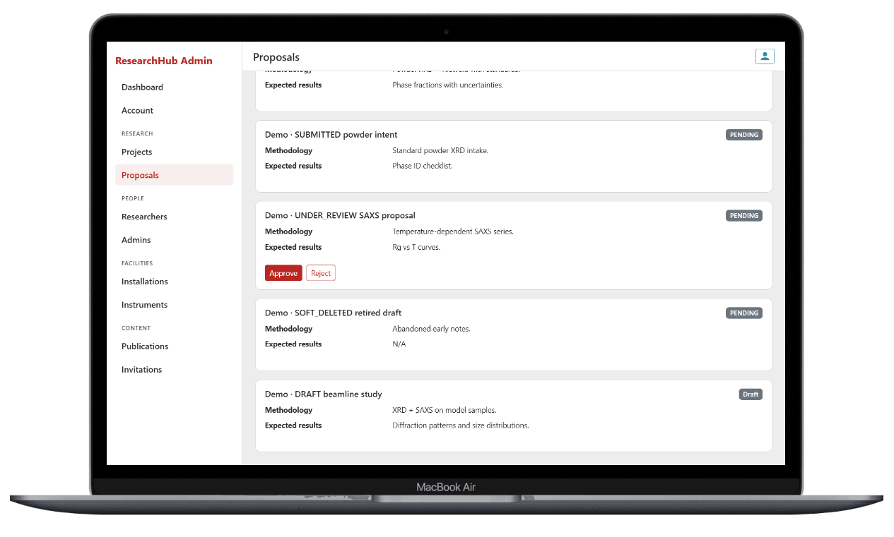
</p>

<br/>

<p align="center"><strong>Delete project confirmation</strong></p>
<p align="center">
  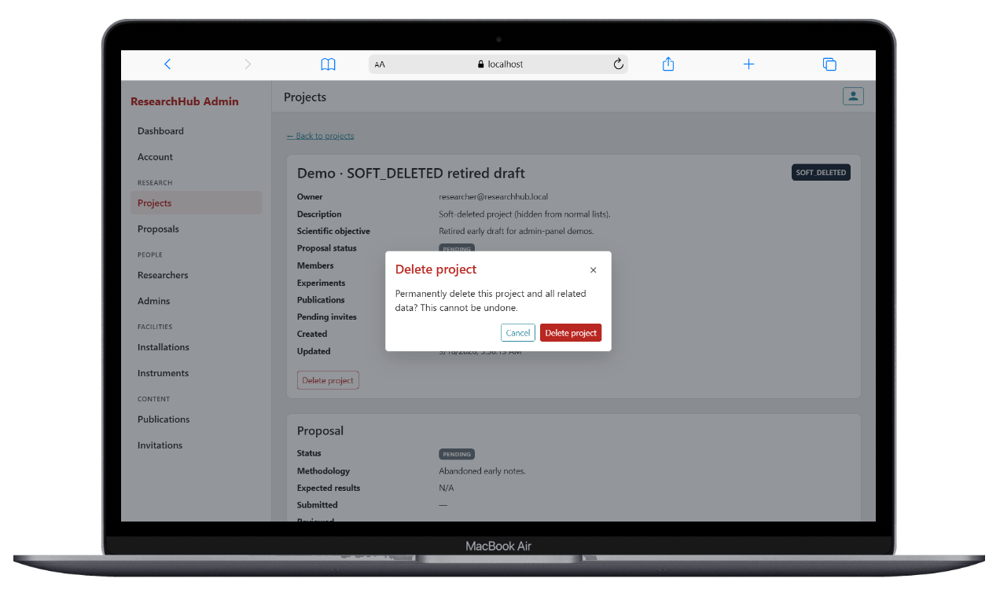
</p>

<br/>

### Mobile

<br/>

<div align="center">

| Client UI | Admin UI |
| --------- | -------- |
| 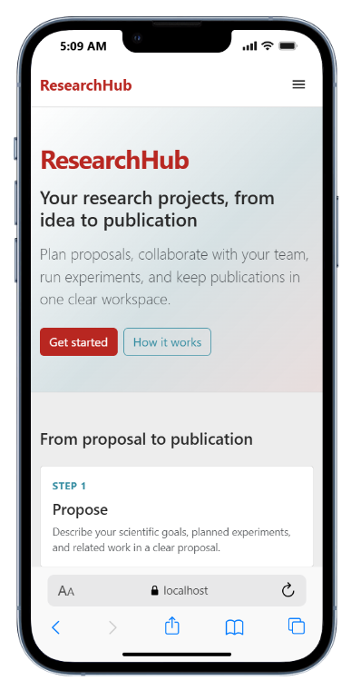 | 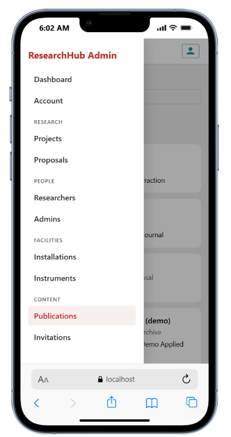 |
| Landing | Responsive dashboard |

</div>

<br/>

---

## Architecture (current)

What runs **today**: local Kubernetes on Docker Desktop, and Docker Compose for everyday coding. Same apps and auth model either way — only how you run them differs. No cloud Ingress / nginx in this repo yet.

<p align="center">
  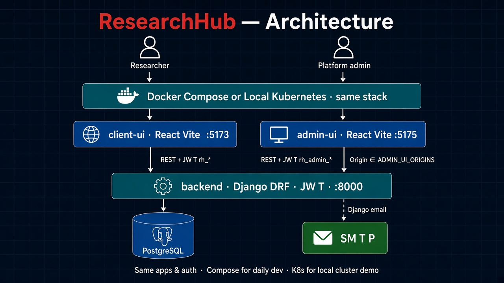
</p>

<br/>

### Local Kubernetes (Docker Desktop)

Cluster demo on your machine. Same apps; ConfigMap/Secret generated from root `.env`.

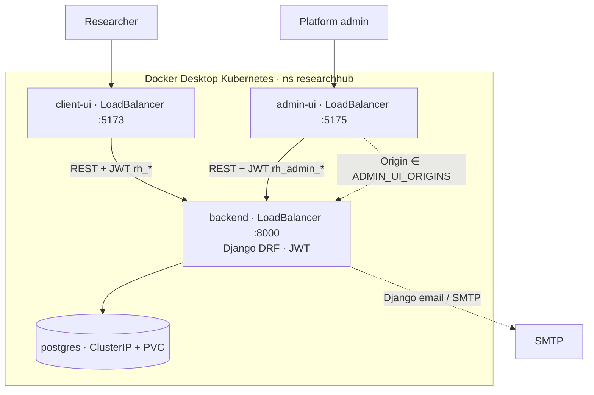

<br/>

<div align="center">

| Service     | Role                                      | Port (default)        |
| ----------- | ----------------------------------------- | --------------------- |
| `client-ui` | Researcher SPA (marketing + dashboard)    | 5173                  |
| `admin-ui`  | Platform admin SPA                        | 5175                  |
| `backend`   | Django REST API + JWT + mailer            | 8000                  |
| `postgres`  | Primary database                          | 5432 (k8s / Compose)  |

</div>

<br/>

- **No local Ingress** — Docker Desktop LoadBalancer maps services to localhost.
- Postgres keeps data on a PVC until you wipe the namespace (`make k8s-delete`).
- Pause without losing DB: `make k8s-stop` · resume: `make k8s-resume`.

Details: [`k8s/README.md`](k8s/README.md)

### Docker Compose (daily)

Same stack and auth for day-to-day development (bind mounts, hot reload).

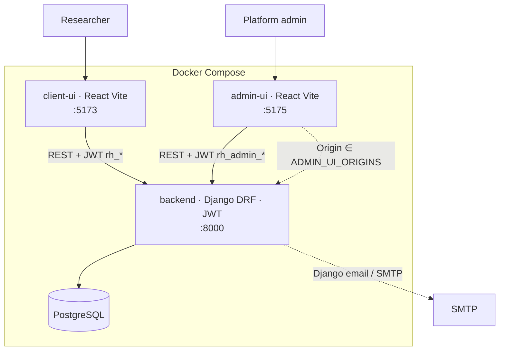

<br/>

Compose: [`docker/README.md`](docker/README.md) · [`docker/docker-compose.yml`](docker/docker-compose.yml) · env: root [`.env.example`](.env.example)

---

## How it works

### Authentication

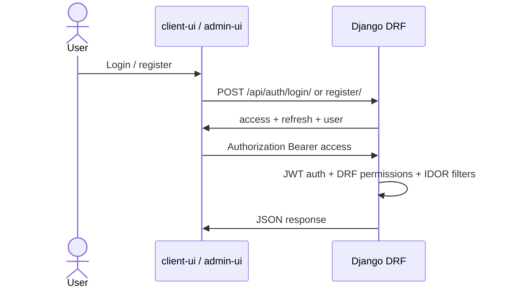

<br/>

<div align="center">

| Layer | Roles |
| ----- | ----- |
| **Platform** | `SUPER_ADMIN` · `ADMIN` · `RESEARCHER` |
| **Project** | `OWNER` · `EDITOR` · `VIEWER` |

</div>

<br/>

- JWT = authentication only (`djangorestframework-simplejwt`).
- Tokens are **per UI origin** (`rh_*` on client-ui · `rh_admin_*` on admin-ui).
- `/api/admin/*` and proposal approve/reject require platform **ADMIN** (or SUPER_ADMIN) **and** `Origin` ∈ `ADMIN_UI_ORIGINS`.

### API surface (high level)

<br/>

<div align="center">

| Area | Path | Notes |
| ---- | ---- | ----- |
| Auth | `/api/auth/*` | register · login · refresh · logout · me |
| Projects & nested | `/api/projects/…` | proposals · experiments · publications · invitations |
| Admin panel | `/api/admin/*` | users · facilities · review tools · Origin check |
| Review | `/api/proposals/{id}/approve|reject/` | admin-ui Origin + platform ADMIN |

</div>

<br/>

Full reference: [`backend/docs/API.md`](backend/docs/API.md)

---

## Database

PostgreSQL schema (Django models). Hub entity is **`ResearchProject`** — proposals, experiments, publications, memberships, and invitations hang off it. Facilities (`Installation` → `Instrument`) are a shared catalog; experiments link a project to an instrument.

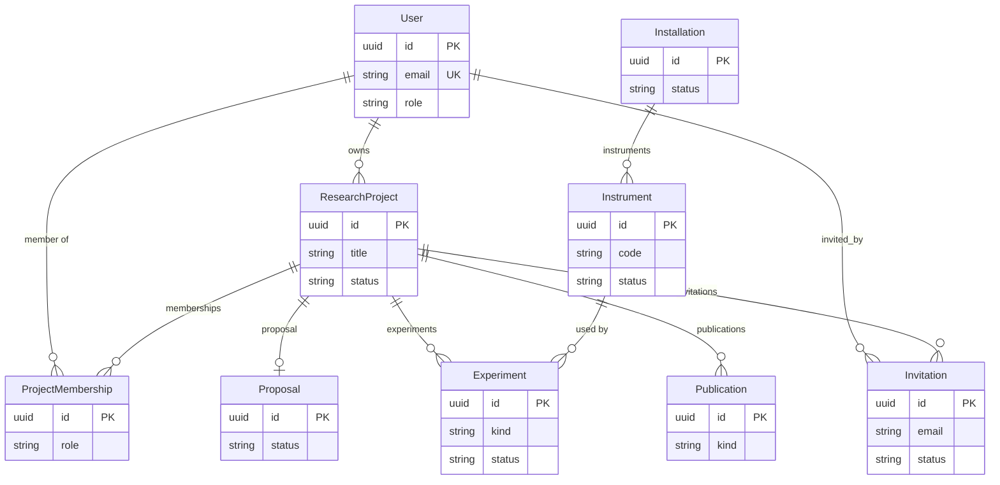

<br/>

<div align="center">

| Entity | Notes |
| ------ | ----- |
| `User` | Platform role · owns projects · memberships · sent invites |
| `ResearchProject` | Soft-delete via status `SOFT_DELETED` (row kept) |
| `Proposal` | **OneToOne** with project (MVP) |
| `ProjectMembership` | Unique `(project, user)` · `OWNER` / `EDITOR` / `VIEWER` |
| `Experiment` | FK to `Instrument` · kind `PLANNED` / `EXECUTED` |
| `Publication` | Linked to project · kind `EXISTING` / `RESULTING` |
| `Invitation` | Membership created **only on accept** · token expires 7 days |
| `Installation` → `Instrument` | Admin catalog · unique `(installation, code)` |

</div>

<br/>

Status machines for project / proposal / experiment / invitation: [Lifecycles](#lifecycles). AuthZ on these rows: [Roles](#roles).

---

## Roles

Two separate role systems. Backend enforces both; UI gates are UX only.

### Platform roles

<br/>

<div align="center">

| Role | App | Can do |
| ---- | --- | ------ |
| `SUPER_ADMIN` | admin-ui | Everything `ADMIN` can + manage admins (`/admins`: list / create / deactivate platform `ADMIN` accounts) |
| `ADMIN` | admin-ui | Stats · researchers · projects overview · proposal approve/reject · facilities CRUD · publications (read) · invitations — **not** the Admins page |
| `RESEARCHER` | client-ui | Register / login · own projects & collaboration — **cannot** use admin-ui |

</div>

<br/>

Admin API calls still require `Origin` ∈ `ADMIN_UI_ORIGINS` (admin-ui origin).

### Project roles (client-ui)

<br/>

<div align="center">

| Role | Read | Edit project / proposal / experiments / publications | Invite / remove collaborators | Soft-delete project |
| ---- | ---- | ---------------------------------------------------- | ----------------------------- | ------------------- |
| `VIEWER` | Yes | No | No | No |
| `EDITOR` | Yes | Yes | No | No |
| `OWNER` | Yes | Yes | Yes | Yes |

</div>

<br/>

Platform `ADMIN` / `SUPER_ADMIN` bypass project membership for access. Proposal **approve / reject** remains admin-only (+ Origin).

More: [`backend/docs/AUTHORIZATION.md`](backend/docs/AUTHORIZATION.md)

---

## Workflow

End-to-end research path. Researchers act in **client-ui**; review happens in **admin-ui**. Status details: [Lifecycles](#lifecycles).

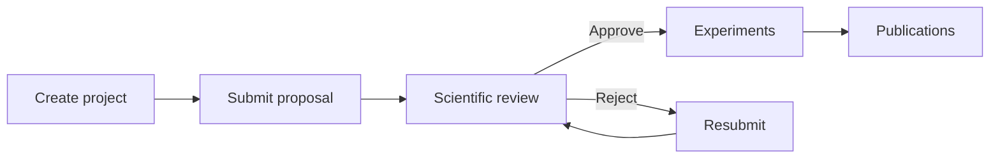

| Actor | UI | Steps |
| ----- | -- | ----- |
| Researcher (`OWNER` / `EDITOR`) | client-ui | Create · submit · resubmit · experiments · publications |
| Platform `ADMIN` / `SUPER_ADMIN` | admin-ui | Approve / reject |

Collaborators join via invitation (`EDITOR` / `VIEWER`); membership is created **only on accept**. See [Invitation](#invitation).

---

## Lifecycles

Statuses below match backend enums (invalid transitions are rejected by the API).

### Project

All statuses: `DRAFT` · `SUBMITTED` · `UNDER_REVIEW` · `APPROVED` · `REJECTED` · `RESUBMITTED` · `IN_PROGRESS` · `COMPLETED` · `SOFT_DELETED`

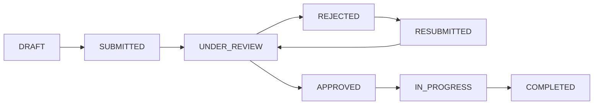

`SOFT_DELETED` is a soft-delete path (owner or platform admin); hidden from normal researcher lists.

### Proposal

One proposal per project (MVP). Reviewed from admin-ui.

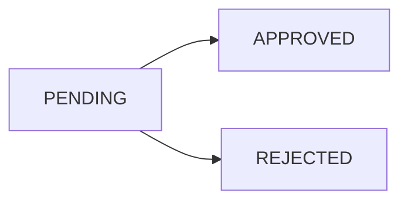

### Experiment

- **Kind:** `PLANNED` · `EXECUTED`
- **Status:** `PLANNED` → `SCHEDULED` → `COMPLETED` / `CANCELLED`

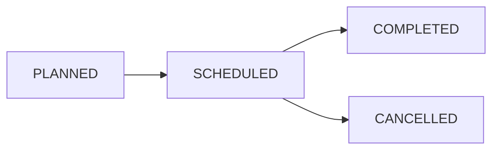

### Invitation

Invite role offered: `EDITOR` or `VIEWER`. Token expires in **7 days**. Membership is created **only on accept**.

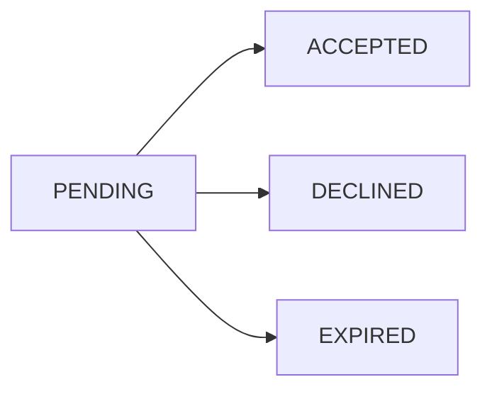

Publications are linked to projects (catalog kinds); no separate public status machine in the MVP.

---

## Security

Never trust `client-ui` or `admin-ui`. AuthN / AuthZ / validation are enforced on the **backend** only.

### Auth & abuse controls

| Control | Where | What for |
| ------- | ----- | -------- |
| JWT (`simplejwt`) | All private API calls | Access **60 min** · refresh **7 days** · rotate + blacklist on logout |
| Per-UI tokens | client-ui `rh_*` · admin-ui `rh_admin_*` | Separate sessions per app — do not share JWTs across UIs |
| Rate limit · `AUTH_RATE_LIMIT` (`5/m` per IP) | `POST /api/auth/register/` · `POST /api/auth/login/` | Slow bot signup and credential stuffing → **429** |
| Rate limit · `PASSWORD_RESET_RATE_LIMIT` (`2/m` per IP) | `POST /api/auth/password-reset/` · `…/confirm/` | Slow reset-email spam and token guessing → **429** |
| Honeypot (`company`) | Public auth forms (register / login / password-reset) | If filled, request is **silently ignored** (bot trap) |
| Password reset anti-enumeration | `POST /api/auth/password-reset/` | Same success-shaped response for known and unknown emails |

Rate-limit code: `backend/users/api/views.py` · `backend/core/ratelimit.py`. Refresh / logout / me are **not** rate-limited this way.

### Authorization

- **Platform roles** (`SUPER_ADMIN` / `ADMIN` / `RESEARCHER`) + **project roles** (`OWNER` / `EDITOR` / `VIEWER`)
- Project access via permissions **and** IDOR-safe selectors (outsiders get **404**, not a leaky 403)
- Never trust client-supplied `role` / `owner` / `project` / `installation` ids
- **Admin gate:** `/api/admin/*` and proposal approve/reject require platform ADMIN **and** `Origin` ∈ `ADMIN_UI_ORIGINS` (admin-ui only — see [`admin-ui/docs/ORIGIN.md`](admin-ui/docs/ORIGIN.md))

### Input validation

Server-side layers (DRF types → constraints → `core.validation`):

- HTML **tags** rejected in user text (plain scientific `<` still allowed)
- Username / codes charset rules · email normalize · max lengths · enum choices
- Relationships resolved from authorized parents (no client re-parenting)

### Invitations & secrets

- Invitation tokens: `secrets.token_urlsafe`, expire in **7 days**, email must match on accept; membership only after accept
- Tokens / SMTP / DB credentials never in normal list/detail API responses
- Secrets only via root `.env` and generated `k8s/secret.yaml` (gitignored)

More: [`backend/docs/SECURITY.md`](backend/docs/SECURITY.md) · [`backend/docs/AUTHENTICATION.md`](backend/docs/AUTHENTICATION.md) · [`backend/docs/AUTHORIZATION.md`](backend/docs/AUTHORIZATION.md)

---

## Project structure

```text
ResearchHub/
├── backend/           # Django + DRF + JWT + docs
├── client-ui/         # Researcher SPA (Vite) + docs
├── admin-ui/          # Platform admin SPA (Vite) + docs
├── k8s/               # Local Docker Desktop Kubernetes manifests
├── docker/
│   ├── docker-compose.yml
│   └── README.md
├── docs/
│   ├── images/        # Architecture diagrams
│   └── PLAN.md        # Production deploy plan (planned)
├── Makefile           # k8s + Compose helpers
├── .env.example
└── README.md
```

Package details: [`backend/README.md`](backend/README.md) · [`client-ui/README.md`](client-ui/README.md) · [`admin-ui/README.md`](admin-ui/README.md) · [`k8s/README.md`](k8s/README.md) · [`docker/README.md`](docker/README.md)

---

## Quick start

**Prerequisites:** [Docker Desktop](https://docs.docker.com/desktop/) (Kubernetes enabled + Compose v2) · Make · `kubectl`

**1. Env**

```powershell
cp .env.example .env
```

### Local Kubernetes

**2. Start**

```powershell
make k8s-start
```

**3. Open**

<br/>

<div align="center">

| URL | Service |
| --- | ------- |
| http://localhost:5173 | Client UI |
| http://localhost:5175 | Admin UI |
| http://localhost:8000/api | Backend API |

</div>

<br/>

**4. Demo data (recommended)**

```powershell
make k8s-seed-demo
```

Loads users, facilities, **9 sample projects** (every project status), proposals covering **PENDING / APPROVED / REJECTED**, experiments, publications, and pending invitations. Idempotent — safe to re-run.

Reset demo data first if you changed the seed:

```powershell
make k8s-clear-demo
make k8s-seed-demo
```

Optional interactive superuser instead (or in addition): `make k8s-createsuperuser`.

**Demo accounts** (password for all: `TestPass123!`)

| Email | Role | Sign in |
| ----- | ---- | ------- |
| `admin@researchhub.local` | SUPER_ADMIN | admin-ui |
| `reviewer@researchhub.local` | ADMIN | admin-ui |
| `researcher@researchhub.local` | RESEARCHER (owns draft + active projects) | client-ui |
| `editor@researchhub.local` | RESEARCHER | client-ui |
| `viewer@researchhub.local` | RESEARCHER | client-ui |
| `collaborator@researchhub.local` | RESEARCHER (owns review project) | client-ui |
| `invitee@researchhub.local` | RESEARCHER (pending invite) | client-ui |

Then open **admin-ui** (http://localhost:5175) or **client-ui** (http://localhost:5173).

**5. Stop / resume / wipe**

```powershell
make k8s-status
make k8s-stop          # pause pods — keeps DB
make k8s-resume
make k8s-delete        # DESTROYS namespace + DB volume
```

### Docker Compose (daily)

Use Compose for everyday coding (hot reload). Stop k8s first if the same ports are in use (`make k8s-stop` or `make k8s-delete`).

```powershell
make start
make seed-demo
make stop
make logs
make status
```

Same demo accounts as above (`make seed-demo`). Optional: `make createsuperuser` for an interactive SUPER_ADMIN.

Reset demo data: `make clear-demo` then `make seed-demo`.

Volumes keep data after `make stop`. Wipe DB with `make clean` (`down -v`).

---

## Objective

Demonstrate a secure full-stack scientific project platform: dual React apps, Django REST with real AuthZ/IDOR protection, a working local Kubernetes deployment path, and Docker Compose for day-to-day development.

---

## Planned (not implemented)

Production **deployment** is planned (not done yet) — local k8s + Compose only for now:

- Cloud / remote Kubernetes cluster
- Ingress · DNS · HTTPS (Let's Encrypt / cert-manager)
- Container registry + CI/CD pipeline
- Optional real cloud deploy

Checklist / notes: [`docs/PLAN.md`](docs/PLAN.md).

---

## License & copyright

Copyright (c) 2026 Chaker Yaakoub.

### Author

**Chaker Yaakoub**

- Portfolio: <a href="https://yaakoub-chaker-bteit.web.app/" target="_blank" rel="noopener noreferrer">yaakoub-chaker-bteit.web.app</a>
- LinkedIn: <a href="https://www.linkedin.com/in/chaker-yaakoub/" target="_blank" rel="noopener noreferrer">chaker-yaakoub</a>
- GitHub: <a href="https://github.com/ChakerYaakoub/" target="_blank" rel="noopener noreferrer">ChakerYaakoub</a>
